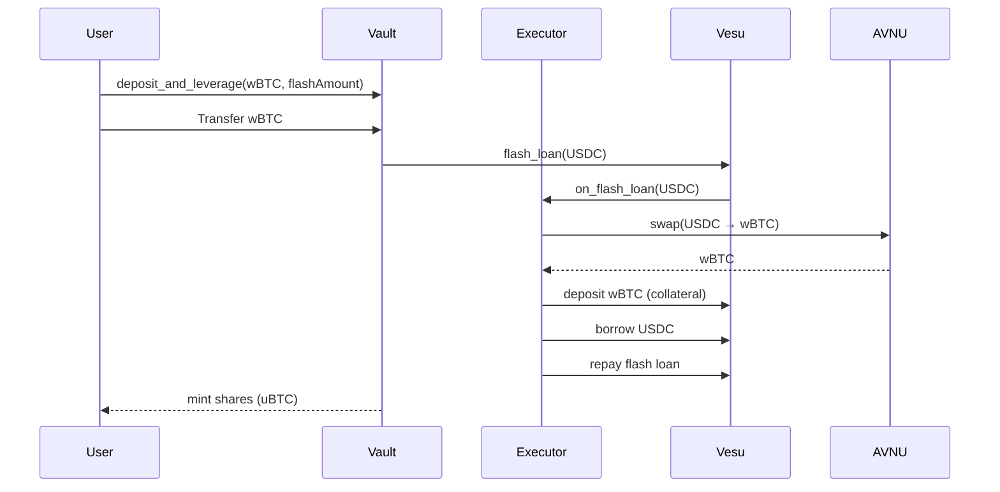
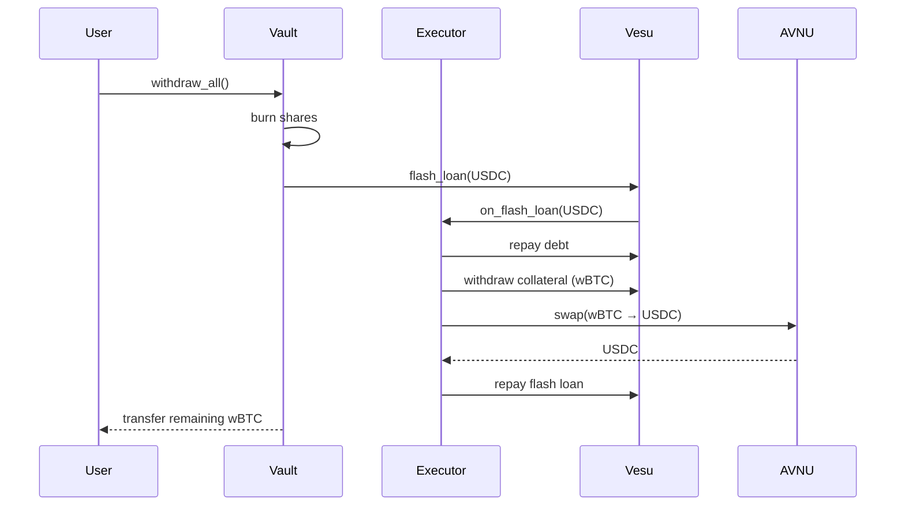

# How It Works

This document explains the complete flow of interacting with Unbound, from deposit to withdrawal.

## Deposit Flow

### Step 1: User Initiates Deposit

The user calls `deposit_and_leverage` with:
- `assets`: Amount of wBTC to deposit
- `flash_loan_amount`: Amount of USDC to flash loan
- `min_collateral_out`: Minimum wBTC expected from swap (slippage protection)
- `avnu_calldata`: Pre-computed swap calldata from AVNU API

### Step 2: Flash Loan Request

```
Vault → Vesu Pool: flash_loan(USDC, flash_loan_amount)
```

Vesu transfers USDC to the Executor and calls `on_flash_loan` callback.

### Step 3: Executor Operations

Inside the flash loan callback, Executor performs:

```
1. Swap USDC → wBTC via AVNU
2. Combine user's wBTC + swapped wBTC
3. Deposit ALL wBTC to Vesu as collateral
4. Borrow USDC from Vesu position
5. Approve Vesu to take USDC (repays flash loan)
```

### Step 4: Share Minting

After the flash loan completes, the Vault:
1. Calculates shares based on deposited assets
2. Mints vault shares (uBTC) to the user

### Deposit Flow Diagram



## Withdrawal Flow

### Step 1: User Initiates Withdrawal

The user calls `withdraw_all` to close their entire position.

### Step 2: Share Burning

Vault calculates the user's share of the position and burns their vault tokens.

### Step 3: Flash Loan for Deleveraging

```
Vault → Vesu Pool: flash_loan(USDC, debt_amount)
```

### Step 4: Executor Unwind

Inside the callback:

```
1. Repay USDC debt on Vesu
2. Withdraw ALL wBTC collateral
3. Swap wBTC → USDC to repay flash loan
4. Transfer remaining wBTC to user
```

### Withdrawal Flow Diagram



## Position State

After a successful deposit, the vault has:

| Component | Location |
|-----------|----------|
| Collateral (wBTC) | Vesu Pool (as collateral in position) |
| Debt (USDC) | Vesu Pool (borrowed amount) |
| Shares (uBTC) | User's wallet |

The Vault itself holds no assets—everything is in Vesu.

## Key Functions

### `deposit_and_leverage`

```cairo
fn deposit_and_leverage(
    assets: u256,           // wBTC amount (8 decimals)
    flash_loan_amount: u256, // USDC to borrow (6 decimals)
    min_collateral_out: u256, // Slippage protection
    avnu_calldata: Array<felt252> // Swap route data
) -> u256 // Returns shares minted
```

### `withdraw_all`

```cairo
fn withdraw_all(
    min_underlying_out: u256, // Minimum wBTC to receive
    avnu_calldata: Array<felt252> // Swap route data
) -> u256 // Returns wBTC withdrawn
```

### View Functions

```cairo
fn get_vault_position() -> (u256, u256)  // (collateral, debt)
fn total_assets() -> u256                 // Total collateral
fn convert_to_shares(assets: u256) -> u256
fn convert_to_assets(shares: u256) -> u256
```
