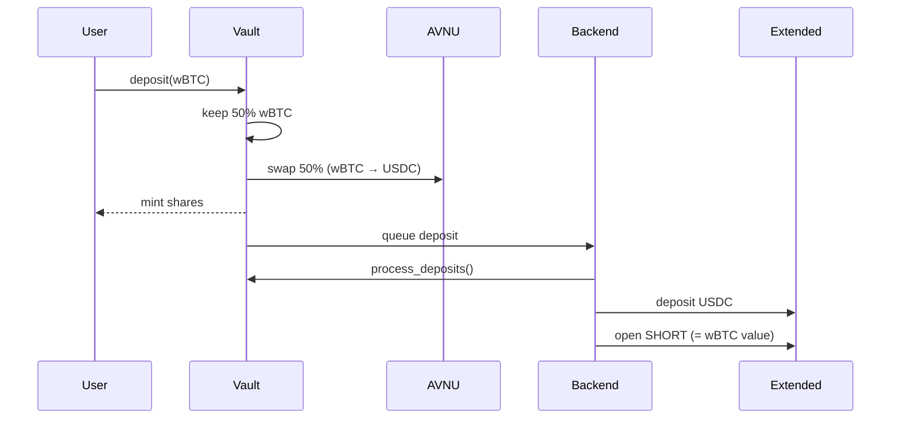
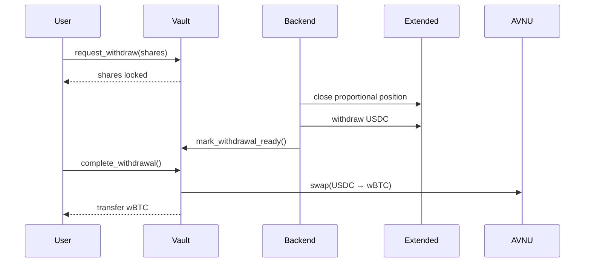

# How It Works

This document explains the complete flow of Unbound's delta-neutral vault.

## Deposit Flow

### Step 1: User Initiates Deposit

User connects wallet and deposits wBTC through the frontend.

### Step 2: Vault Processes Deposit

The vault smart contract:
1. Receives user's wBTC
2. Keeps 50% as wBTC in vault (LONG exposure)
3. Swaps other 50% to USDC via AVNU
4. Queues deposit for backend processing
5. Mints vault shares to user

### Step 3: Backend Opens Position

Backend `DepositProcessor` detects queued deposit:
1. Calls `process_deposits()` on vault (mints shares, transfers USDC)
2. Deposits USDC to Extended exchange
3. Opens SHORT position matching wBTC value (delta-neutral)

### Deposit Flow Diagram



## Delta-Neutral Position

After deposit, the vault holds:

| Component | Location | BTC Exposure |
|-----------|----------|--------------|
| 50% wBTC | Vault contract | +0.5 BTC (LONG) |
| 50% USDC | Extended exchange | 0 (margin) |
| SHORT position | Extended | -0.5 BTC |
| **Net exposure** | | **0 (NEUTRAL)** |

## Funding Payments

Extended charges/pays funding every hour using this formula:

```
Funding Payment = Position Size × Mark Price × Funding Rate
```

### When Funding is Positive (84% of time)
```
Longs pay → Shorts receive
Result: Your equity in Extended grows
```

### When Funding is Negative (16% of time)
```
Shorts pay → Longs receive
Result: Your equity in Extended shrinks
```

### Position Manager

Backend `PositionManager` monitors funding rate every 60 seconds:
- If funding < -0.01%: Closes all shorts to avoid paying
- If funding recovers: Allows reopening positions

## NAV Calculation

**NAV = wBTC Value + Extended Equity**

```
Example with $5,000 deposit:
├── wBTC held: 0.0284 BTC × $88,000 = $2,500
├── Extended equity: $2,600 (including funding earned)
└── Total NAV: $5,100
```

Share value = NAV / Total Shares

## Withdrawal Flow

### Step 1: User Requests Withdrawal

User calls `request_withdraw(shares)` on vault:
- Shares are locked
- Withdrawal queued with status PENDING

### Step 2: Backend Processes Withdrawal

Backend `WithdrawalProcessor` detects pending withdrawal:
1. Calculates USDC value of shares
2. Closes proportional short position
3. Withdraws USDC from Extended
4. Calls `mark_withdrawal_ready()` on vault

### Step 3: User Completes Withdrawal

User calls `complete_withdrawal()`:
1. Vault swaps USDC → wBTC via AVNU
2. Distributes proportional wBTC from vault holdings
3. Burns shares
4. Sends total wBTC to user

### Withdrawal Flow Diagram



## Key Events

| Event | What Happens |
|-------|--------------| 
| User Deposits | 50% kept as wBTC, 50% → USDC → Extended → SHORT |
| Funding Payment | Every hour, equity grows/shrinks based on funding rate |
| User Withdraws | Close proportional SHORT → USDC + wBTC → User |
