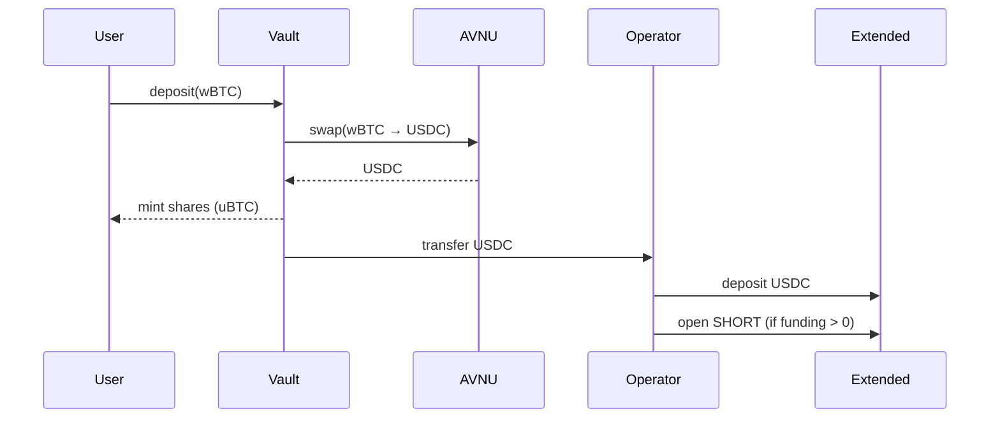
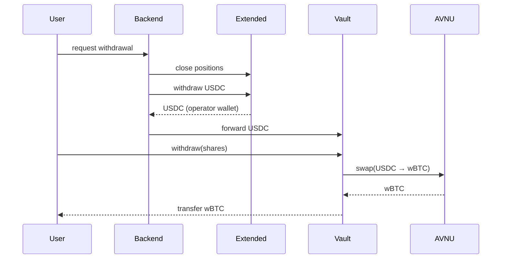

# How It Works

This document explains the complete flow of Unbound, from deposit to withdrawal.

## Deposit Flow

### Step 1: User Initiates Deposit

User connects wallet and deposits wBTC through the frontend:

```
User → Frontend: deposit wBTC
```

### Step 2: Vault Swaps to USDC

The vault smart contract:
1. Receives user's wBTC
2. Swaps wBTC → USDC via AVNU
3. Mints vault shares (uBTC) to user
4. Sends USDC to operator wallet

### Step 3: Automatic Deposit to Extended

Backend detects USDC in operator wallet and:
1. Deposits USDC to Extended exchange
2. Executes strategy (opens SHORT if funding > 0)

### Deposit Flow Diagram



## Strategy Execution

The backend runs the strategy automatically:

### When Funding is Positive
```
Backend: Open SHORT BTC-USD position
Result: Receive hourly funding payments
```

### When Funding is Negative
```
Backend: Close SHORT position
Result: Avoid paying funding
```

### Strategy Loop

```
Every hour:
  1. Check current funding rate
  2. If funding > threshold AND no position:
     → Open SHORT (size = equity × leverage)
  3. If funding < -threshold AND has position:
     → Close position
  4. If position exists:
     → Receive funding payment
```

## Withdrawal Flow

### Step 1: User Requests Withdrawal

User clicks "Request Withdrawal" on the frontend.

### Step 2: Backend Prepares Funds

Backend:
1. Closes any open positions on Extended
2. Requests USDC withdrawal from Extended
3. Extended sends USDC to operator wallet

### Step 3: USDC Forwarded to Vault

Backend forwards USDC from operator wallet to vault contract.

### Step 4: User Completes Withdrawal

User calls `withdraw()` on vault contract:
1. Burns user's shares
2. Swaps USDC → wBTC via AVNU
3. Sends wBTC to user

### Withdrawal Flow Diagram



## Position State

At any time, the vault has:

| Component | Location |
|-----------|----------|
| User Shares | User's wallet (uBTC tokens) |
| USDC Collateral | Extended exchange |
| SHORT Position | Extended exchange (when active) |
| Unrealized PnL | Extended account |

## Key Events

| Event | What Happens |
|-------|--------------|
| User Deposits | wBTC → USDC → Extended → Open SHORT |
| Funding Payment | Every hour, receive funding if SHORT |
| User Withdraws | Close SHORT → USDC → wBTC → User |
