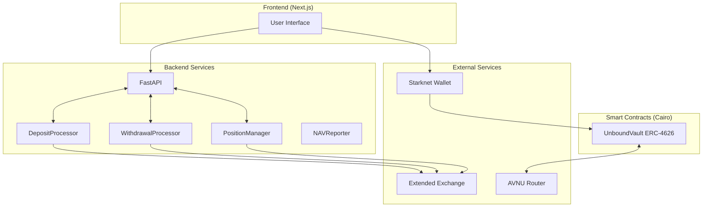

# Architecture

This document describes the technical architecture of Unbound's delta-neutral vault.

## System Overview



## Smart Contracts

### Vault Contract (`vault.cairo`)

ERC-4626 tokenized vault with queue system:

**Storage:**
```cairo
// Assets
underlying_asset: wBTC
collateral_asset: USDC
total_wbtc_held: u256  // wBTC kept for LONG exposure

// Queue system
deposit_queue_head/tail: u256
withdrawal_queue_head/tail: u256
pending_deposits: Map<u256, DepositRequest>
pending_withdrawals: Map<u256, WithdrawalRequest>
```

**Key Functions:**
```cairo
fn deposit(wbtc_amount, min_shares, avnu_calldata) -> request_id
fn request_withdraw(shares, min_assets) -> request_id
fn complete_withdrawal(request_id, avnu_calldata)
fn process_deposits(count)  // Operator only
fn mark_withdrawal_ready(request_id, usdc_amount)  // Operator only
```

## Backend Services

### DepositProcessor (`deposit_processor.py`)

Polls vault for pending deposits every 30 seconds:
1. Reads deposit queue from contract
2. For each unprocessed deposit:
   - Calls `process_deposits()` (mints shares, transfers USDC)
   - Deposits USDC to Extended
   - Opens SHORT position

### WithdrawalProcessor (`withdrawal_processor.py`)

Polls vault for pending withdrawals every 30 seconds:
1. Detects PENDING withdrawals
2. Calculates USDC value of shares
3. Closes proportional position on Extended
4. Requests USDC withdrawal from Extended
5. Calls `mark_withdrawal_ready()` when USDC arrives

### PositionManager (`position_manager.py`)

Monitors position health every 60 seconds:
- Checks funding rate
- Closes positions if funding < -0.01%
- Reopens when funding recovers
- Monitors margin ratio for liquidation risk

### NAVReporter (`nav_reporter.py`)

Reports NAV to vault periodically:
- Calculates: wBTC value + Extended equity
- Signs NAV update
- Submits to vault contract

## API Endpoints

| Endpoint | Method | Description |
|----------|--------|-------------|
| `/api/status` | GET | Vault status, NAV, delta |
| `/api/apy` | GET | Funding rate and APY estimates |
| `/api/position` | GET | Current short position details |
| `/api/queues/status` | GET | Deposit/withdrawal queue status |
| `/api/funding-history` | GET | Historical funding payments |

## External Integrations

### Extended Exchange

Perpetual futures on Starknet:
- Deposit contract: `0x062da0780fae...`
- Funding payments every hour
- Formula: `Position × Price × Rate`

### AVNU Router

DEX aggregator for swaps:
- Address: `0x04270219d365d6...`
- Used for wBTC ↔ USDC swaps on deposit/withdrawal

## Data Flow

### Deposit
```
User wBTC → Vault (keep 50%) → AVNU (swap 50%) → 
Backend → Extended deposit → Open SHORT
```

### Yield Generation
```
Every hour: Extended calculates funding
If rate > 0: Shorts receive payment → Equity grows
```

### Withdrawal
```
Close SHORT → Withdraw USDC from Extended →
Vault swaps to wBTC → Combine with vault wBTC → User
```

## Security Model

| Component | Trust Model |
|-----------|-------------|
| Vault Contract | Trustless (on-chain, verified) |
| Operator Backend | Trust to run strategy, cannot steal funds |
| Extended Exchange | Custody risk for USDC collateral |
| AVNU Swaps | Trustless (atomic, slippage protected) |
