# Architecture

## Overview

Unbound consists of two main smart contracts that work together to provide leveraged vault functionality:

```mermaid
graph TB
    subgraph Unbound["UNBOUND SYSTEM"]
        Vault["🏦 Vault<br/>(ERC-4626)"]
        Executor["⚡ Executor<br/>(Flash Loan Receiver)"]
    end
    
    subgraph External["EXTERNAL PROTOCOLS"]
        Vesu["🏛️ Vesu V2 Pool<br/>Flash Loans • Positions • Collateral/Debt"]
        AVNU["🔄 AVNU Router<br/>DEX Aggregator"]
    end
    
    Vault --> Executor
    Vault --> Vesu
    Executor --> Vesu
    Executor --> AVNU
```



## Contract Details

### UnboundVault

**Purpose**: User-facing contract for deposits and withdrawals. Implements ERC-4626 tokenized vault standard.

**Key Responsibilities**:
- Accept user deposits
- Mint/burn vault shares
- Track user positions
- Coordinate with Executor for leverage operations
- Collect performance fees

**Storage**:
```cairo
struct Storage {
    underlying_asset: ContractAddress,  // wBTC
    debt_asset: ContractAddress,        // USDC
    vesu_pool: ContractAddress,
    executor: ContractAddress,
    paused: bool,
    performance_fee_bps: u256,
    treasury: ContractAddress,
}
```

### FlashLoanExecutor

**Purpose**: Handles the flash loan callback and executes the leverage/deleverage operations.

**Key Responsibilities**:
- Receive flash loans from Vesu
- Execute swaps via AVNU
- Manage Vesu position (deposit collateral, borrow debt)
- Ensure atomicity of operations

**Security**: Only the Vesu Pool can call `on_flash_loan`.

```cairo
fn on_flash_loan(
    sender: ContractAddress,  // Must be Vault
    asset: ContractAddress,   // USDC
    amount: u256,
    data: Span<felt252>       // Operation details
)
```

## External Integrations

### Vesu V2

[Vesu](https://vesu.xyz) is Starknet's lending protocol used for:

| Function | Usage |
|----------|-------|
| `flash_loan` | Get USDC without collateral |
| `modify_position` | Add collateral / borrow debt |
| `position` | Query current position state |
| `price` | Get asset oracle prices |

**Pool Parameters** (wBTC/USDC pair):
- Max LTV: 86%
- Liquidation Factor: 90%
- Borrow APR: Variable (~1.8%)
- BTCFi Rewards: ~1.4% (reduces net cost)

### AVNU

[AVNU](https://avnu.fi) is a DEX aggregator for optimal swap execution:

| Function | Usage |
|----------|-------|
| `multi_route_swap` | Execute USDC ↔ wBTC swaps |

**Why AVNU?**
- Best execution across multiple DEXs
- Single transaction for complex routes
- Built-in slippage protection

## Data Flow

### Position Creation

```mermaid
flowchart LR
    A[User] -->|1. deposit_and_leverage| B[Vault]
    A -->|2. wBTC transfer| B
    B -->|3. flash_loan| C[Vesu]
    C -->|4. on_flash_loan| D[Executor]
    D -->|5. swap USDC→wBTC| E[AVNU]
    D -->|6. deposit collateral| C
    D -->|7. borrow USDC| C
    D -->|8. repay flash| C
    B -->|9. mint shares| A
```



### Position Closure

```mermaid
flowchart LR
    A[User] -->|1. withdraw_all| B[Vault]
    B -->|2. burn shares| B
    B -->|3. flash_loan| C[Vesu]
    C -->|4. on_flash_loan| D[Executor]
    D -->|5. repay debt| C
    D -->|6. withdraw wBTC| C
    D -->|7. swap wBTC→USDC| E[AVNU]
    D -->|8. repay flash| C
    B -->|9. transfer wBTC| A
```



## Trust Model

| Entity | Trust Level | Why |
|--------|-------------|-----|
| Vault Owner | High | Can pause, set fees |
| Executor | Medium | Only vault can trigger operations |
| Vesu | Critical | Holds all collateral and debt |
| AVNU | Medium | Swap execution only |
| User | None needed | Permission-less interaction |

## Upgrade Path

Current contracts are **not upgradeable**. To upgrade:
1. Deploy new vault with updated logic
2. Users withdraw from old vault
3. Users deposit to new vault

This ensures users always have full control over their assets.
